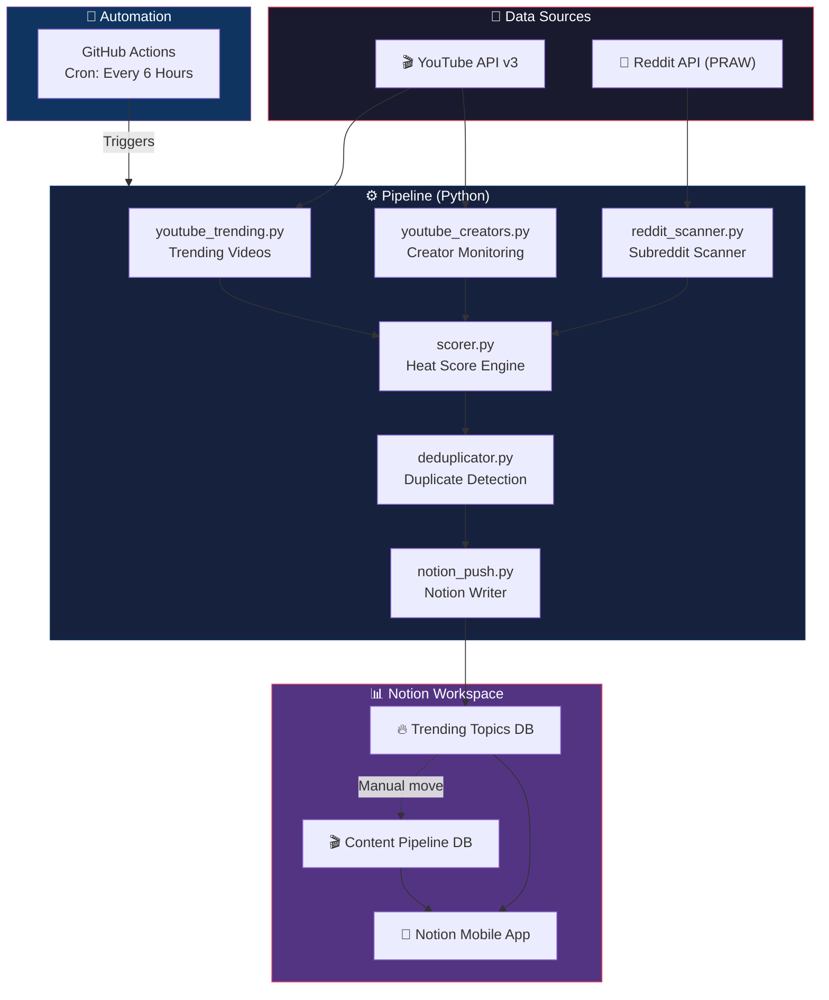

# 🎮 Gaming Trending Content Pipeline

> **Automatically discover trending gaming content from YouTube & Reddit, scored and delivered to your Notion workspace — every 6 hours, completely free.**

---

## 📖 Table of Contents

- [Project Overview](#-project-overview)
- [Architecture](#-architecture)
- [Setup Guide](#-setup-guide-step-by-step)
  - [1. Create a GitHub Account](#1--create-a-github-account)
  - [2. Notion Setup](#2--notion-setup)
  - [3. YouTube API Setup](#3--youtube-api-setup)
  - [4. Reddit API Setup](#4--reddit-api-setup)
  - [5. Environment Variables](#5--environment-variables)
  - [6. Local Testing](#6--local-testing)
  - [7. GitHub Repository Setup](#7--github-repository-deploy--automate)
  - [8. Accessing from Phone](#8--accessing-from-your-phone)
  - [9. Adding Team Members](#9--adding-team-members)
- [Recommended Notion Views](#-recommended-notion-views)
- [Troubleshooting](#-troubleshooting)
- [Future Enhancements](#-future-enhancements-roadmap)

---

## 🔍 Project Overview

This pipeline automates the most tedious part of content creation — **finding what's trending right now** in the gaming space.

### What It Does

| Feature | Details |
|---------|---------|
| **YouTube Trending** | Fetches top trending gaming videos from YouTube's trending feed |
| **YouTube Creators** | Monitors specific gaming creators for new uploads & breakout content |
| **Reddit Pulse** | Scans 8 gaming subreddits for rising posts & hot discussions |
| **Heat Scoring** | Assigns a heat score (0–100) based on velocity, engagement & recency |
| **Notion Delivery** | Pushes scored topics into two Notion databases automatically |
| **Scheduling** | Runs every 6 hours via GitHub Actions (6 AM, 12 PM, 6 PM, 12 AM) |
| **Cost** | **$0/month** — all free tiers |

### Subreddits Monitored

| Subreddit | Focus |
|-----------|-------|
| r/gaming | General gaming news & memes |
| r/Games | Industry news & discussion |
| r/pcgaming | PC-specific trends |
| r/PS5 | PlayStation ecosystem |
| r/XboxSeriesX | Xbox ecosystem |
| r/NintendoSwitch | Nintendo ecosystem |
| r/GameDeals | Sales & deals (time-sensitive) |
| r/IndieGaming | Indie breakout titles |

### Notion Databases

1. **🔥 Trending Topics** — Where discovered trends land, scored and categorized
2. **🎬 Content Pipeline** — Where you plan, assign, and track content creation

---

## 🏗 Architecture



### Data Flow

```
YouTube API ──┐
              ├──▶ Fetch ──▶ Score ──▶ Deduplicate ──▶ Push to Notion
Reddit API ───┘
```

1. **Fetch** — Pull trending videos, creator uploads, and subreddit posts
2. **Score** — Calculate heat score based on views, upvotes, velocity, and recency
3. **Deduplicate** — Check against existing Notion entries to avoid duplicates
4. **Push** — Create new pages in the Trending Topics database

---

## 🚀 Setup Guide (Step by Step)

> ⏱ **Total setup time: ~30 minutes** (most of it is copying API keys around)

---

### 1. 🐙 Create a GitHub Account

> *Already have one? [Skip to Notion Setup →](#2--notion-setup)*

GitHub will host your code and run the pipeline automatically for free.

1. Go to **[github.com](https://github.com)**
2. Click **"Sign up"** (top right)
3. Enter your email, create a password, choose a username
4. Complete the verification puzzle
5. Select the **Free** plan (that's all you need!)

✅ **Done!** This takes about 2 minutes.

---

### 2. 📝 Notion Setup

This is the longest step, but it's all point-and-click. You'll:
- Create an integration (so the pipeline can write to Notion)
- Create two databases (where trends and content plans live)
- Connect them together

#### Step 2a: Create a Notion Integration

1. Go to **[notion.so/my-integrations](https://www.notion.so/my-integrations)**
2. Click **"+ New integration"**
3. Fill in:
   - **Name:** `Trending Pipeline`
   - **Associated workspace:** Select your workspace
   - **Logo:** Optional (pick a 🔥 emoji if you like)
4. Click **"Submit"**
5. You'll see your **Internal Integration Token** — it starts with `ntn_`
6. **⚠️ Copy this token and save it somewhere safe** (you'll need it later)
   - Click "Show" then "Copy"
   - Paste it in a note temporarily

> 💡 **Screenshot description:** You'll see a page titled "Integration" with a field labeled "Internal Integration Secret" showing a long string starting with `ntn_`. There's a "Show" link and a "Copy" button next to it.

#### Step 2b: Create the Trending Topics Database

1. Open Notion and go to any page (or create a new one called "Content HQ")
2. Type `/database` and select **"Database - Full page"**
3. Title it: `🔥 Trending Topics`
4. Now add these properties (click the `+` next to the last column header):

| Property Name | Type | Options/Notes |
|--------------|------|---------------|
| **Title** | Title | *(exists by default — rename to "Title")* |
| **Source** | Select | Add options: `YouTube`, `Reddit`, `Creator`, `Manual` |
| **Heat Score** | Number | Format: Number (no decimal) |
| **Heat Level** | Select | Add options: `🔥 Hot`, `🟠 Warm`, `🔵 Cool` |
| **Tier** | Select | Add options: `T1 Hidden Gem`, `T2 High Volume`, `T3 News` |
| **Time Sensitive** | Checkbox | *(just add it, no config needed)* |
| **Source URL** | URL | *(just add it, no config needed)* |
| **Source Stats** | Text | *(rich text — for storing view counts, upvotes, etc.)* |
| **Discovered At** | Date | *(just add it, no config needed)* |
| **Status** | Select | Add options: `New`, `Reviewed`, `Queued`, `Passed` |

> 💡 **Adding a property:** Click the `+` button in the table header → type the property name → select the type from the dropdown → add select options if needed.

#### Step 2c: Create the Content Pipeline Database

1. Create another full-page database
2. Title it: `🎬 Content Pipeline`
3. Add these properties:

| Property Name | Type | Options/Notes |
|--------------|------|---------------|
| **Title** | Title | *(exists by default — rename to "Title")* |
| **Status** | Select | Add options: `Idea`, `Scripting`, `Filming`, `Editing`, `Posted` |
| **Tier** | Select | Add options: `T1`, `T2`, `T3` |
| **Platform** | Multi-select | Add options: `Shorts`, `Reels`, `Long-form` |
| **Assignee** | Person | *(just add it — lets you tag team members)* |
| **Due Date** | Date | *(just add it, no config needed)* |
| **Notes** | Text | *(rich text — for scripts, angles, talking points)* |
| **Posted URL** | URL | *(link to the published content)* |

#### Step 2d: Share Databases with Your Integration

**⚠️ This step is critical — without it, the pipeline can't write to your databases!**

For **each** database (🔥 Trending Topics AND 🎬 Content Pipeline):

1. Open the database page
2. Click the **`···`** menu (top right corner)
3. Scroll down to **"Connections"**
4. Click **"Add connections"**
5. Search for `Trending Pipeline` (the integration you created)
6. Click it, then confirm

> 💡 **Screenshot description:** The `···` menu is open showing various options. Near the bottom, there's a "Connections" section with a search field. The "Trending Pipeline" integration appears in the list with a toggle to connect it.

#### Step 2e: Copy Your Database IDs

You need the unique ID for each database. Here's how to find it:

1. Open the database in your browser
2. Look at the URL — it looks like this:
   ```
   https://www.notion.so/yourworkspace/abc1234567890def1234567890abcdef?v=...
                                       ^^^^^^^^^^^^^^^^^^^^^^^^^^^^^^^^
                                       This 32-character string is your Database ID
   ```
3. Copy that 32-character hex string (the part after the last `/` and before the `?`)
4. Do this for **both** databases

> 📝 **Save these somewhere:**
> - Trending Topics DB ID: `________________________________`
> - Content Pipeline DB ID: `________________________________`

---

### 3. 🎬 YouTube API Setup

The YouTube Data API v3 lets us fetch trending videos and channel data.

1. Go to **[console.cloud.google.com](https://console.cloud.google.com)**
2. Sign in with your Google account
3. Click **"Select a project"** (top bar) → **"New Project"**
4. Name it: `Trending Pipeline`
5. Click **"Create"** and wait a few seconds
6. Make sure your new project is selected (check the top bar)

#### Enable the YouTube API

7. Go to **[APIs & Services → Library](https://console.cloud.google.com/apis/library)**
8. Search for **"YouTube Data API v3"**
9. Click on it → Click **"Enable"**
10. Wait for it to activate (takes a few seconds)

#### Create an API Key

11. Go to **[APIs & Services → Credentials](https://console.cloud.google.com/apis/credentials)**
12. Click **"+ CREATE CREDENTIALS"** → **"API key"**
13. A dialog shows your new key — **copy it immediately**
14. Click **"Edit API key"** (or find it in the list and click on it)
15. Under **"API restrictions"**:
    - Select **"Restrict key"**
    - Check **"YouTube Data API v3"** only
    - Click **"Save"**

> 💡 **Why restrict?** If your key leaks, attackers can only use it for YouTube (which has its own free quota) instead of racking up charges on paid APIs.

> 📝 **Save your YouTube API Key:** `________________________________`

#### Free Quota

YouTube Data API v3 gives you **10,000 units/day** for free. Each search request costs ~100 units, so you can make ~100 searches/day. Our pipeline uses about 10–20 per run × 4 runs/day = 40–80 units. **Way under the limit.**

---

### 4. 🤖 Reddit API Setup

Reddit's API lets us scan subreddits for trending posts.

1. Make sure you're logged into Reddit
2. Go to **[reddit.com/prefs/apps](https://www.reddit.com/prefs/apps)**
3. Scroll down and click **"create another app..."** (or "are you a developer? create an app...")
4. Fill in:
   - **Name:** `TrendingPipeline`
   - **Type:** Select **"script"** (important!)
   - **Description:** `Gaming content trend scanner`
   - **About URL:** *(leave blank)*
   - **Redirect URI:** `http://localhost:8080`
5. Click **"create app"**

#### Copy Your Credentials

After creating, you'll see your app listed:

```
TrendingPipeline
personal use script
─────────────────────
client_id:     t5_XXXXXX      ← under the app name, short string
                               
secret:        YYYYYYYYYYYY    ← labeled "secret"
```

- **Client ID:** The short string displayed directly under the app name (looks like `AbC123dEfG456`)
- **Client Secret:** The longer string labeled "secret"

> 📝 **Save these:**
> - Reddit Client ID: `________________________________`
> - Reddit Client Secret: `________________________________`
> - Reddit Username: `________________________________`
> - Reddit Password: `________________________________`

---

### 5. 🔐 Environment Variables

Now let's put all those keys together!

#### Create your `.env` file

```bash
# In the project root directory:
cp .env.example .env
```

If `.env.example` doesn't exist, create `.env` manually with this content:

```env
# ─── YouTube ──────────────────────────────
YOUTUBE_API_KEY=your_youtube_api_key_here

# ─── Reddit ───────────────────────────────
REDDIT_CLIENT_ID=your_reddit_client_id_here
REDDIT_CLIENT_SECRET=your_reddit_client_secret_here
REDDIT_USER_AGENT=TrendingPipeline/1.0 by YourRedditUsername

# ─── Notion ───────────────────────────────
NOTION_API_KEY=ntn_your_notion_integration_token_here
NOTION_TRENDING_DB_ID=your_32char_trending_database_id
NOTION_PIPELINE_DB_ID=your_32char_pipeline_database_id
```

#### Variable Reference

| Variable | Where to Find It | Example |
|----------|-----------------|---------|
| `YOUTUBE_API_KEY` | Google Cloud Console → Credentials | `AIzaSyB...` |
| `REDDIT_CLIENT_ID` | reddit.com/prefs/apps → under app name | `AbC123dEfG456` |
| `REDDIT_CLIENT_SECRET` | reddit.com/prefs/apps → "secret" field | `xYz789...` |
| `REDDIT_USER_AGENT` | You make this up (format below) | `TrendingPipeline/1.0 by u/yourname` |
| `NOTION_API_KEY` | notion.so/my-integrations → your integration | `ntn_abc123...` |
| `NOTION_TRENDING_DB_ID` | Notion database URL (32-char hex) | `abc1234567890def...` |
| `NOTION_PIPELINE_DB_ID` | Notion database URL (32-char hex) | `fed0987654321cba...` |

> **⚠️ NEVER commit your `.env` file to GitHub!** The `.gitignore` file already excludes it, but double-check.

---

### 6. 🧪 Local Testing

Let's make sure everything works before deploying!

#### Prerequisites

- **Python 3.10+** — Check with `python3 --version`
- If you don't have Python, download it from [python.org](https://www.python.org/downloads/)

#### Run the Pipeline Locally

```bash
# 1. Clone or navigate to the project
cd /path/to/trending

# 2. Create a virtual environment
python3 -m venv .venv

# 3. Activate it
source .venv/bin/activate        # macOS/Linux
# .venv\Scripts\activate         # Windows

# 4. Install dependencies
pip install -r requirements.txt

# 5. Run the pipeline!
python src/main.py
```

#### What to Expect

```
2026-05-31 12:00:00 | INFO | 🚀 Starting Trending Content Pipeline...
2026-05-31 12:00:01 | INFO | 📺 Fetching YouTube trending videos...
2026-05-31 12:00:03 | INFO |    Found 15 trending gaming videos
2026-05-31 12:00:04 | INFO | 👤 Checking creator uploads...
2026-05-31 12:00:06 | INFO |    Found 8 new creator videos
2026-05-31 12:00:07 | INFO | 🤖 Scanning Reddit (8 subreddits)...
2026-05-31 12:00:15 | INFO |    Found 42 trending posts
2026-05-31 12:00:16 | INFO | 📊 Scoring 65 items...
2026-05-31 12:00:16 | INFO | 🔄 Deduplicating against Notion...
2026-05-31 12:00:18 | INFO |    Removed 12 duplicates
2026-05-31 12:00:19 | INFO | 📤 Pushing 53 new items to Notion...
2026-05-31 12:00:28 | INFO | ✅ Pipeline complete! 53 new trends added.
```

#### Quick Checks

- ✅ Open your **🔥 Trending Topics** database in Notion — you should see new entries!
- ✅ Each entry should have a heat score, source, and tier
- ✅ Check that the Source URLs actually link to real videos/posts

---

### 7. 🚀 GitHub Repository: Deploy & Automate

Now let's put this in the cloud so it runs by itself!

#### Step 7a: Create a GitHub Repository

1. Go to **[github.com/new](https://github.com/new)**
2. Fill in:
   - **Repository name:** `trending-pipeline` (or whatever you like)
   - **Visibility:** **Private** (recommended — it contains your pipeline logic)
   - **Do NOT** initialize with README (we already have one!)
3. Click **"Create repository"**

#### Step 7b: Push Your Code

```bash
# In your project directory:
git init
git add .
git commit -m "🚀 Initial commit: Trending content pipeline"
git branch -M main
git remote add origin https://github.com/YOUR_USERNAME/trending-pipeline.git
git push -u origin main
```

#### Step 7c: Add Secrets

**⚠️ This is how you securely store API keys on GitHub (they're encrypted).**

1. Go to your repository on GitHub
2. Click **Settings** (tab at the top)
3. In the left sidebar: **Secrets and variables** → **Actions**
4. Click **"New repository secret"** for each of these:

| Secret Name | Value |
|------------|-------|
| `YOUTUBE_API_KEY` | Your YouTube API key |
| `REDDIT_CLIENT_ID` | Your Reddit client ID |
| `REDDIT_CLIENT_SECRET` | Your Reddit client secret |
| `REDDIT_USER_AGENT` | `TrendingPipeline/1.0` |
| `NOTION_API_KEY` | Your Notion integration token |
| `NOTION_TRENDING_DB_ID` | Your Trending Topics database ID |
| `NOTION_PIPELINE_DB_ID` | Your Content Pipeline database ID |

> 💡 **Screenshot description:** The Secrets page shows a list of secret names (values are hidden with `***`). There's a green "New repository secret" button at the top right.

#### Step 7d: Enable GitHub Actions

The pipeline includes a workflow file at `.github/workflows/pipeline.yml`. It's automatically recognized by GitHub.

1. Go to the **"Actions"** tab in your repository
2. You should see the workflow listed
3. If prompted, click **"I understand my workflows, go ahead and enable them"**

#### Step 7e: Test with Manual Dispatch

1. Go to **Actions** tab
2. Click **"Trending Pipeline"** in the left sidebar
3. Click **"Run workflow"** dropdown (right side)
4. Select the `main` branch
5. Click **"Run workflow"** button
6. Watch the run — click on it to see live logs

> 💡 Once confirmed working, the pipeline will automatically run at **12:00 AM, 6:00 AM, 12:00 PM, and 6:00 PM UTC** every day.

#### GitHub Actions Workflow (Reference)

The workflow file should look like this (`.github/workflows/pipeline.yml`):

```yaml
name: Trending Pipeline

on:
  schedule:
    - cron: '0 */6 * * *'  # Every 6 hours
  workflow_dispatch:         # Manual trigger button

jobs:
  run-pipeline:
    runs-on: ubuntu-latest
    steps:
      - uses: actions/checkout@v4

      - name: Set up Python
        uses: actions/setup-python@v5
        with:
          python-version: '3.12'

      - name: Install dependencies
        run: pip install -r requirements.txt

      - name: Run pipeline
        env:
          YOUTUBE_API_KEY: ${{ secrets.YOUTUBE_API_KEY }}
          REDDIT_CLIENT_ID: ${{ secrets.REDDIT_CLIENT_ID }}
          REDDIT_CLIENT_SECRET: ${{ secrets.REDDIT_CLIENT_SECRET }}
          REDDIT_USER_AGENT: ${{ secrets.REDDIT_USER_AGENT }}
          NOTION_API_KEY: ${{ secrets.NOTION_API_KEY }}
          NOTION_TRENDING_DB_ID: ${{ secrets.NOTION_TRENDING_DB_ID }}
          NOTION_PIPELINE_DB_ID: ${{ secrets.NOTION_PIPELINE_DB_ID }}
        run: python src/main.py
```

---

### 8. 📱 Accessing from Your Phone

The best part — all your trending data is in Notion, which has a great mobile app!

#### Download Notion

- **iOS:** [App Store](https://apps.apple.com/app/notion/id1232780281)
- **Android:** [Google Play](https://play.google.com/store/apps/details?id=notion.id)

#### Setup

1. Sign in with the **same account** you used on desktop
2. Your workspace, databases, and all data sync automatically
3. You'll see 🔥 Trending Topics and 🎬 Content Pipeline in your sidebar

#### Recommended Mobile Views

Create these saved views for quick mobile access:

| View | Database | Setup |
|------|----------|-------|
| **🔥 Hot Right Now** | Trending Topics | Filter: Heat Level = "🔥 Hot" + Status = "New", Sort: Heat Score ↓ |
| **📋 My Tasks** | Content Pipeline | Filter: Assignee = You, Sort: Due Date ↑ |
| **💡 Idea Bank** | Content Pipeline | Filter: Status = "Idea", Sort: Created ↓ |

> 💡 **Pro tip:** Star (⭐) your most-used views in Notion — they'll appear at the top of your sidebar on mobile for one-tap access.

---

### 9. 👥 Adding Team Members

Notion makes collaboration easy (and free for small teams).

#### Invite to Your Workspace

1. Click **"Settings & members"** in the Notion sidebar
2. Click **"Members"** → **"Invite"**
3. Enter their email address
4. Set their role:
   - **Member:** Full access to shared pages (best for teammates)
   - **Guest:** Access only to pages explicitly shared with them

> 💡 **Free plan:** You can invite up to **10 guests** for free. For more, consider Notion's Plus plan.

#### Share Specific Databases

If you want to share only the pipeline databases (not your entire workspace):

1. Open the database
2. Click **"Share"** (top right)
3. Enter their email
4. Set permission: **"Can edit"** or **"Can view"**

#### Team Workflow

```
Pipeline discovers trends ──▶ Everyone sees new items in "🔥 Trending Topics"
                                          │
                              Team reviews & discusses
                                          │
                              Move best ideas to "🎬 Content Pipeline"
                                          │
                              Assign to team members
                                          │
                              Track through: Idea → Scripting → Filming → Editing → Posted
```

---

## 🎨 Recommended Notion Views

Set up these views in your databases for maximum productivity:

### 🔥 Trending Topics Database

| View Name | Type | Configuration |
|-----------|------|--------------|
| **📊 All Trends** | Table | Default view, sort by Discovered At (newest first) |
| **🆕 New & Unreviewed** | Table | Filter: Status = "New", sort by Heat Score ↓ |
| **🖼 Heat Gallery** | Gallery | Group by Heat Level, shows visual cards |
| **📡 By Source** | Board/Kanban | Group by Source (YouTube / Reddit / Creator) |

### 🎬 Content Pipeline Database

| View Name | Type | Configuration |
|-----------|------|--------------|
| **📋 Kanban Board** | Board | Group by Status (Idea → Scripting → Filming → Editing → Posted) |
| **📅 Calendar** | Calendar | By Due Date — see your content schedule |
| **👤 My Tasks** | Table | Filter: Assignee = Me, sort by Due Date ↑ |
| **🏆 Completed** | Gallery | Filter: Status = "Posted", sort by date ↓ |

#### How to Create Views

1. Open any database
2. Click **"+ Add a view"** (top left, next to existing view tabs)
3. Name your view
4. Select the view type (Table, Board, Calendar, Gallery, etc.)
5. Use **Filter** and **Sort** to customize
6. The view saves automatically

---

## 🔧 Troubleshooting

### Common Issues

| Problem | Cause | Fix |
|---------|-------|-----|
| `401 Unauthorized` from Notion | Integration not connected to database | Re-do [Step 2d](#step-2d-share-databases-with-your-integration) |
| `403 Forbidden` from YouTube | API key restricted or wrong project | Check key restrictions in Google Cloud Console |
| `401` from Reddit | Wrong client ID/secret | Re-check credentials at reddit.com/prefs/apps |
| No data in Notion | `.env` not loaded or wrong DB IDs | Verify DB IDs match the URL, check `.env` format |
| Duplicates appearing | Deduplication check failing | Ensure `Title` property exists and is the title type |
| GitHub Action failing | Secrets not set | Check all 7 secrets are added (Settings → Secrets) |

### Checking GitHub Actions Logs

1. Go to your repo → **Actions** tab
2. Click the latest workflow run
3. Click **"run-pipeline"** to expand the job
4. Click **"Run pipeline"** step to see the Python output
5. Errors will be highlighted in red

### Rate Limits

| Service | Free Limit | Our Usage | Buffer |
|---------|-----------|-----------|--------|
| YouTube API | 10,000 units/day | ~320 units/day (4 runs) | ✅ 96% headroom |
| Reddit API | 60 requests/min | ~10 requests/run | ✅ Way under |
| Notion API | 3 requests/sec | ~1 request/sec peak | ✅ Comfortable |
| GitHub Actions | 2,000 min/month (free) | ~20 min/month | ✅ 99% headroom |

---

## 🗺 Future Enhancements Roadmap

### Phase 2 — Notifications & AI (Coming Soon)

| Feature | Description | Tech |
|---------|-------------|------|
| 📲 **WhatsApp Alerts** | Get a message when a 🔥 Hot trend is discovered | Twilio API |
| 🤖 **AI Content Angles** | Auto-generate 3 content angle suggestions per trend | Google Gemini API |
| 📊 **Daily Digest** | Morning summary of overnight trends | Twilio / Email |

### Phase 3 — Expanded Sources

| Feature | Description | Tech |
|---------|-------------|------|
| 🐦 **X/Twitter Integration** | Monitor gaming hashtags & viral tweets | X API v2 |
| 📡 **Creator RSS Tracking** | Follow creator blogs, patch notes, dev updates | RSS/Atom feeds |
| 🎮 **Steam Trending** | Track Steam's trending games & reviews | Steam Web API |
| 📰 **News Aggregation** | Gaming news sites (IGN, Kotaku, etc.) | RSS + scraping |

### Phase 4 — Analytics

| Feature | Description | Tech |
|---------|-------------|------|
| 📈 **Trend History** | Track which trends turned into successful content | Notion + Python |
| 🎯 **Hit Rate Dashboard** | See your trend-to-viral conversion rate | HTML dashboard |
| ⏰ **Optimal Timing** | Suggest best posting times based on trend data | Data analysis |

---

## 📁 Project Structure

```
trending/
├── .github/
│   └── workflows/
│       └── pipeline.yml        # GitHub Actions cron job
├── src/
│   ├── main.py                 # Entry point — orchestrates everything
│   ├── youtube_trending.py     # YouTube trending fetcher
│   ├── youtube_creators.py     # Creator channel monitor
│   ├── reddit_scanner.py       # Reddit subreddit scanner
│   ├── scorer.py               # Heat score calculation
│   ├── deduplicator.py         # Duplicate detection
│   └── notion_push.py          # Notion API writer
├── .env.example                # Template for environment variables
├── .env                        # Your actual secrets (git-ignored!)
├── .gitignore                  # Keeps secrets & junk out of git
├── requirements.txt            # Python dependencies
└── README.md                   # You are here! 👋
```

---

## 🤝 Contributing

Got ideas? Found a bug? Here's how to help:

1. **Fork** the repo
2. **Create** a feature branch (`git checkout -b feature/awesome-idea`)
3. **Commit** your changes (`git commit -m 'Add awesome feature'`)
4. **Push** to your branch (`git push origin feature/awesome-idea`)
5. **Open** a Pull Request

---

## 📄 License

This project is for personal/team use. Modify freely for your content creation workflow!

---

<div align="center">

**Built with ❤️ for content creators who'd rather create than research**

*Found a trending topic? Go make a banger. 🎮🔥*

</div>
